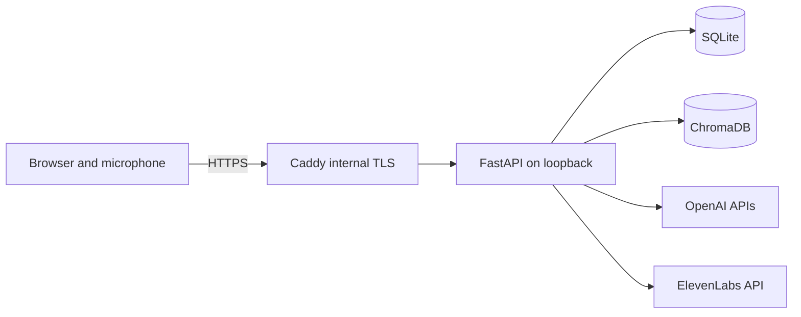

# Live AI Therapy

Live AI Therapy is a responsive, LAN-hosted voice assistant for guided psychological-support conversations. Its configurable Sandy persona speaks with the user through OpenAI transcription and response generation, ElevenLabs speech, and language-isolated local memory.

> [!IMPORTANT]
> This is not a licensed psychologist, medical service, crisis service, or substitute for professional care. Do not rely on it as the only protection in an emergency.

## Features

- Responsive dark and light interface for desktop and mobile browsers.
- Hands-free microphone capture with voice activity detection and manual fallback.
- OpenAI transcription, conversational responses, and embeddings.
- ElevenLabs speech with configurable voice and speaking speed.
- Configurable Markdown persona and evidence-informed CBT, ACT, and CFT reference material.
- SQLite transcripts and summaries plus ChromaDB semantic memory stored on the host.
- Language-isolated continuity across recent and older sessions.
- Draggable and collapsible session-topics panel.
- Accessible controls, keyboard navigation, reduced-motion support, and safe-area layouts.
- Caddy internal HTTPS, Avahi/mDNS discovery, firewall rules, and automatic systemd restart.
- No camera access, public cloud database, authentication layer, or public Internet ingress.

## Quick installation

Officially supported hosts are current MX Linux, Debian, and Ubuntu releases with `systemd`, `apt`, and a LAN connection.

```bash
git clone https://github.com/andre-ramos/live-ai-therapy.git && cd live-ai-therapy
sudo ./install.sh
```

The installer prompts for the local hostname, LAN address, OpenAI key, ElevenLabs key, and ElevenLabs voice ID. It then installs dependencies, creates private storage, configures Caddy and Avahi, starts the services, and verifies the backend.

Open the printed `https://...local` address from a device on the same network. Install and trust the exported Caddy root certificate before granting microphone permission. The certificate is normally written to `/opt/live-ai-therapy/certs/live-therapy-local-ca.crt`.

The installer adds an HTTPS firewall rule but does not automatically enable an inactive UFW installation. Review existing SSH/firewall access before running `sudo ufw enable`.

## How a voice turn works

1. The browser monitors microphone levels locally and records only a detected spoken turn.
2. Silence, mute, manual stop, or the duration limit closes the recording.
3. FastAPI temporarily stores the audio and sends it to OpenAI for transcription.
4. The backend retrieves relevant same-language context and asks OpenAI for Sandy's reply.
5. Transcript and response text are stored in local SQLite.
6. ElevenLabs synthesizes the reply; the temporary generated audio is returned to the browser.
7. Incoming audio is deleted after transcription unless debug audio storage is explicitly enabled.



## Privacy model

The following remain on the host:

- API credentials and the selected voice ID.
- Session records, message text, summaries, topics, structured continuity, and durable memories.
- ChromaDB vectors and metadata.
- Persona files and private portrait overrides.
- Temporary incoming and generated audio files.

The following are sent to providers:

- OpenAI receives recorded turns for transcription, prompt context needed for a response, and memory text selected for embedding.
- ElevenLabs receives Sandy's generated response text and the configured voice identifier.

No memory database, `.env`, certificate, private portrait, or raw application data is committed to this repository. See [SECURITY.md](SECURITY.md) for reporting and deployment guidance.

## Provider requirements

You need:

- An OpenAI API account with billing enabled for transcription, chat completion, and embeddings.
- An ElevenLabs account with API access and a voice ID.

Provider usage is metered independently of this project. The application continues with text when ElevenLabs synthesis fails, but core OpenAI operations require valid credentials.

## Configuration

Runtime secrets are stored outside the repository. For local development, copy `.env.example` to `.env`. Production installation writes `/etc/live-ai-therapy/live-ai-therapy.env` with mode `600`.

Important settings include:

| Setting | Purpose |
|---|---|
| `OPENAI_API_KEY` | OpenAI API authentication |
| `ELEVENLABS_API_KEY` | ElevenLabs API authentication |
| `ELEVENLABS_VOICE_ID` | Sandy's configured voice identity |
| `DATABASE_URL` | SQLite storage URL |
| `VECTOR_DB_PATH` | ChromaDB persistence directory |
| `AUDIO_TMP_PATH` | Temporary audio directory |
| `PERSONA_FILE` | Optional private persona override |
| `MEMORY_DEBUG_ENABLED` | Debug memory endpoint; keep `false` without authentication |

Application behavior is configured in `config/psychologist.yaml`, including VAD timing, model names, memory behavior, emergency guidance, and ElevenLabs speed. Supported speed values are `0.7` through `1.2`; `1.0` is normal speed.

### Persona and portrait

The public persona is `config/personas/sandy.md`. Its front matter selects `assets/sandy.jpg`, language, voice model, and the CBT/ACT/CFT sections from `psychologist_approaches_bilingual.md`.

To use a private persona without changing tracked files:

1. Create `config/personas/sandy.local.md`.
2. Optionally place a private portrait such as `config/personas/Sandy.jpeg` beside it.
3. Set `PERSONA_FILE=config/personas/sandy.local.md` in the runtime environment.
4. Restart `live-therapy.service`.

Both private paths are ignored by Git. A bare image filename is resolved only inside `config/personas`; a project-relative image path is accepted only directly inside `assets`. Absolute paths and directory traversal are rejected.

## Local development

```bash
python3 -m venv .venv
.venv/bin/python -m pip install -r backend/requirements.txt
cp .env.example .env
# Add provider credentials to .env.
.venv/bin/alembic upgrade head
.venv/bin/uvicorn backend.app.main:app --host 127.0.0.1 --port 8088
```

The frontend is served at `http://127.0.0.1:8088`. Loopback is accepted for browser microphone access; non-loopback clients require trusted HTTPS.

### Tests

```bash
npm test
.venv/bin/python -m pytest backend/tests -q
.venv/bin/alembic heads
bash scripts/check-public-repo.sh
```

Tests use fake providers and temporary storage, so they do not consume provider credits.

## Public API

| Method | Path | Purpose |
|---|---|---|
| `GET` | `/api/health` | Database, persona, vector memory, and provider readiness |
| `GET` | `/api/persona` | Safe active-persona metadata |
| `GET` | `/api/persona/image` | Active persona portrait |
| `POST` | `/api/session/start` | Start a session using the active persona language |
| `POST` | `/api/voice-turn` | Upload one recorded turn and receive text/audio response |
| `GET` | `/api/audio/{audio_id}` | Retrieve temporary generated speech |
| `GET` | `/api/session/{session_id}/messages` | Retrieve stored session messages |
| `POST` | `/api/session/{session_id}/end` | End, summarize, and extract memory |
| `POST` | `/api/session/{session_id}/summarize` | Generate or refresh a session summary |
| `DELETE` | `/api/session/{session_id}` | Delete a session and associated records |
| `DELETE` | `/api/memory/{memory_id}` | Delete one durable memory |

Errors use `{ "code": "...", "message": "...", "retryable": false }`.

## Operations

```bash
sudo systemctl status live-therapy.service caddy live-therapy-mdns.service
sudo journalctl -u live-therapy.service -n 100 --no-pager
curl http://127.0.0.1:8088/api/health
```

Back up the runtime environment, SQLite database, ChromaDB directory, and private persona files to encrypted storage. Do not back up temporary generated audio unless required. Stop the service during a consistency-sensitive SQLite/Chroma backup.

To update a public installation, pull a trusted release in the source clone and rerun `sudo ./install.sh`. Existing credentials are retained when the credential prompts are left blank.

To remove the application, stop and disable the three services, remove their unit/configuration files, and then remove `/opt/live-ai-therapy`, `/etc/live-ai-therapy`, and `/var/lib/live-ai-therapy`. Back up data first if it must be retained.

## Browser support and limitations

Current Chrome, Edge, Firefox, Safari, Android Chrome, and iOS Safari are targeted. Browser recording formats and automatic VAD vary; manual start/stop is used where automatic capture is unavailable.

The default deployment is intentionally unauthenticated and LAN-only. Do not expose it directly to the Internet. A multi-user or Internet-facing deployment requires authentication, per-user memory isolation, authorization, rate limiting, stronger audit controls, and a reviewed privacy policy.

## Contributing

See [CONTRIBUTING.md](CONTRIBUTING.md). Changes require tests and a pull request; deployments run only from trusted commits merged to `main`.

## License

[MIT](LICENSE)
